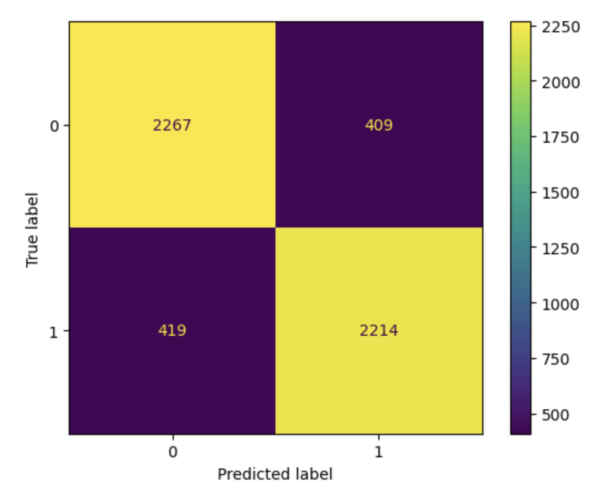

# League-of-Legends-Winner-Predictor
My exploratory data analysis on this data set can be found here : [The-Carry](https://ndxdxd.github.io/The-Carry/)

## Framing The Problem: Predicting if a Team will win or lose a game before the matcn ends.
I'm building a binary classifier model that predicts the outcome of a game before it ends. To do this, I'll use a response variable called "results" that contains either a 1 or a 0, with 1 indicating that the team won and 0 indicating that they lost. I chose this variable because it provides a clear indication of the game's outcome.

To evaluate the performance of my model, I'm using the accuracy metric, which is the proportion of predictions that are correct since it will help me determine whether or not a team wins.

To make my predictions, I'll be using dataset but only the columns that were recorded both before and during the match. This means that I can incorporate stats that are accumulated during the game to improve the accuracy of my predictions. 

## Baseline Model:
Creating my model, I decided to use a DecisionTreeClassifier with a maximum depth of two. I only included the 'killsat15', 'assistsat15', 'deathsat15', 'xpat15', 'goldat15', and 'csat15' columns as the quantitative values and the side and ban columns were the qualitative values, giving me a total of six quantitative and six qualitative variables. 

For the qualitative variables, I used the OneHotEncoding transformer to encode its values. For each of the bans columns, I encoded each champion that was banned (there were at most 162 unique champions in the game during the time of this data set was released), as well as the team's side, which were only either blue or red.

I'm pleased with my current model because it's straightforward to interpret and doesn't require any quantitative transformations. Despite these specifications, my baseline model has achieved nearly the same accuracy score on the test data as it did on the training data, with an accuracy score just under 0.70, giving me confidence that my model is performing well and provides a solid starting point for further improvements.

## Final Model:
To improve my model's accuracy in predicting whether a team will win or not, I added several features: firstblood, firstbaron, firstdragon, firstherald, firsttower, and firstmidtower columns. These features were already binarized in the dataset which indicates whether or not team has achieved those objectives during the game.

In addition, I addressed the skewness of my quantatitive columns by performing a standardization transformer onto the goldat15, csat15, and xpat15 columns as well as a quantile transformation onto the kills assists and deaths columns.

Furthermore, I upgraded my basemodel by implementing a gridsearchcv. This method helped prevent my model from overfitting or underfitting my training data by selecting the most optimal hyperparameters. After testing every combination of hyperparameters, the best ones turned out to be {'dt__criterion': 'entropy', 'dt__max_depth': 5, 'dt__min_samples_split': 200}.

Overall, I believe these features have improved my model's performance by accounting for the data set's ambiguity and allowing it to generalize better to unseen test data. Compared to my base model, my final model is a significant improvement, as it incorporates more features and transformations, with higher accuracy scores across training and test data sets.

Four our gridsearch,the hyperparemeters that I am going to tune are the max depth, the min_samples_split, and the criterion.

I decided to tune the max depth as it controls the maximum depth of the decision tree, with a high value potentially leading to overfitting while a low value could potentially lead to underfitting.

I decided to tune the min_samples_split as it controls the minimum number of samples required to split an internal node, with a high value potentially leading to overfitting while a low value potentially leading to underfitting.

I decided to tune the criterion hyperparameter since it contains two values, gini or entropy. Both gini and entropy are used to find the optimal split at each node of a decision tree, which is why it is important for us to choose how the splits occur as they both measure the quality of each split.

Confusion Matrix:

## Fairness Analysis
For my fairness anaylsis, I will be exploring my model's performance on teams that drew firstblood, vs the teams that did not draw first blood, which happened to be already binarized in our data set. Out evaluation metric will be the precision, since I care more about the proportion of predicted positive instances that are correctly classified, in this case the proportion of teams that were correctly classified as winning when acheiving first blood.

To do so, I will be conducting a Hypothesis Test.

Null Hypothesis: Our model is fair. Its precision for teams that got first blood and teams that didn't are roughly the same, and any differences are due to random chance.
Alt Hypothesis:  Our model is unfair. Its precision for teams that did not get first blood are lower than its precision for teams that did get first blood.
Test Statistic: Difference in Precisions
Significance Level: 0.01

<iframe src="assets/diffinprecgraph.html" width=800 height=600 frameBorder=0></iframe>

The result is a p value of 0.002.
Since the p val = 0.002, this is less than my significance level of 0.01. This means that the null hypothesis is unlikely to be true, and I reject the null hypothesis. Therefore, I have sufficient evidence supporting the alternative hypothesis that my model seems to be unfair, that the precision of the model for teams that did not get first blood is less than precision for teams that did get first blood.

